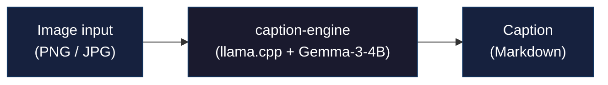
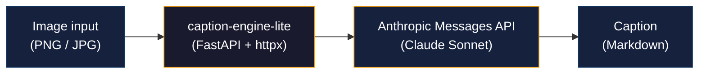

# caption-engine — Technical Documentation

## Architecture

### Local Mode (GPU)



> GPU-only (Local mode), minimum 4 GB VRAM. Base image: `nvidia/cuda:13.2.1-runtime-ubuntu24.04`

### Lite Mode (Anthropic API)



> No GPU required. Base image: `python:3.12-slim` (~600 MB). Sequential API calls via shared httpx client.

### Backend Selection

Set `LLM_BACKEND` environment variable at startup:

| Value | Backend | Image |
|-------|---------|-------|
| `local` (default) | llama.cpp + Gemma-3-4B | `ghcr.io/cubebecu/caption-engine:latest` (~12 GB) |
| `anthropic` | Anthropic Messages API | `ghcr.io/cubebecu/caption-engine-lite:latest` (~600 MB) |

---

## Web UI

Four tabs (identical across both modes):

**Caption tab:**
- Drag & drop image(s), click to browse, select folder, or paste with `Ctrl+V`
- Single image: preview + "Generate Caption" button
- Multiple images: batch queue panel with progress bar, per-file status
- Click "Process All" for batch (SSE streaming, sequential processing)
- Output shown with model, timing, dimensions
- Copy to clipboard or save as `.md` file

**Results tab:**
- List of all caption jobs (latest first)
- Each job shows: image thumbnail, caption preview, metadata
- Per-job actions: Copy caption, download `.md`, download image, Delete job
- Jobs persist across restarts (volume mount)

**Logs tab:**
- Live application logs from the server
- Refresh and download log output

**Configuration tab:**
- Edit system prompt (sent with every request)
- Save to live config
- View model & runtime info

---

## GPU Requirements (Local Mode Only)

- **Minimum 4GB VRAM** — enforced at startup
- **No CPU fallback** — exits with error if no GPU or insufficient VRAM
- All 32 layers offloaded to GPU (`GPU_LAYERS=32`)
- Context size: **4096 tokens** (fits model + KV cache in 4GB)

### Lite Mode — No GPU Required

Runs on any machine with Docker. Requirements:
- Valid `ANTHROPIC_API_KEY` environment variable
- Internet connection for API calls
- ~128 MB RAM at runtime

---

## Resilience & Safety

### Local Mode
- **Llama-server health monitor** — background task pings `/v1/models` every 15s; auto-restarts on crash
- **Circuit breaker** — after 5 failed restarts, `/caption` returns `503` instead of hanging
- **Model detection** — auto-detects latest Sonnet from API (Lite mode only)

### Lite Mode
- **Health check optimization** — `/health/model` does NOT call Anthropic API; checks client initialization state only
- **Shared httpx client** — single connection pool (`max_connections=2`) prevents request hangs in uvicorn async context
- **Timeout config** — `connect=10s, read=300s, write=60s, pool=5s` for vision model slowness

### Both Modes
- **Image validation** — rejects uploads >16MB, non-image formats, corrupted files, and dimensions >16384px (anti zip-bomb)
- **Thumbnails** — 320×240 JPEG thumbnails generated on job save; served via `/jobs/{id}/thumbnail`
- **Log rotation** — `server.log` rotates at 10MB, keeps 5 backups

---

## API Reference

| Endpoint              | Method   | Description                        |
|-----------------------|----------|------------------------------------|
| `/`                   | GET      | Web UI                           |
| `/caption`            | POST     | Generate caption from image        |
| `/caption/batch`      | POST     | Batch process images (SSE stream)  |
| `/health`             | GET      | Health check                       |
| `/health/model`       | GET      | Vision model reachability          |
| `/config`             | GET      | Current configuration              |
| `/config`             | PUT      | Update system prompt               |
| `/config`             | DELETE   | Reset to default system prompt     |
| `/config/default`     | GET      | Default system prompt              |
| `/logs`               | GET      | Application log lines              |
| `/jobs`               | GET      | List all caption jobs              |
| `/jobs/{id}`          | DELETE   | Delete a job (image + caption)     |
| `/jobs/{id}/image`    | GET      | Download job image                 |
| `/jobs/{id}/thumbnail`| GET      | Get 320×240 JPEG thumbnail         |
| `/jobs/{id}/caption.md` | GET    | Download job caption as .md        |

### `/caption` request

```
multipart/form-data:
  image         — image file (PNG/JPEG/GIF/BMP)
  system_prompt — optional override for system prompt
```

**Output is always Markdown.** No format selector — the model is prompted to produce markdown-formatted descriptions by default.

### `/caption` response

```json
{
  "caption": "A flowchart showing the authentication pipeline...",
  "model": "Gemma-3-4B",
  "processing_time_ms": 3420,
  "image_size": {"width": 1920, "height": 1080},
  "job_id": "a3f8b2c1d4e5"
}
```

> In Lite mode, `model` reflects the auto-detected Claude Sonnet model ID (e.g., `claude-sonnet-4-6`).

### `/caption/batch` request

```
multipart/form-data:
  images        — up to 100 image files (PNG/JPEG/GIF/BMP, max 8MB each)
  system_prompt — optional override for system prompt
```

Response is an SSE (`text/event-stream`) stream. Events:

| Event      | Payload | Description |
|------------|---------|-------------|
| `progress` | `{current, total, filename}` | Processing progress |
| `result`   | same as `/caption` response | Per-image caption result |
| `error`    | `{filename, detail}` | Per-image error |
| `done`     | `{processed, failed}` | Batch complete |

Processing is sequential. In Local mode, if llama-server crashes mid-batch, remaining images are skipped with `error` events. In Lite mode, API errors are reported per-image.

### `/config` PUT request

```json
{
  "system_prompt": "Your custom prompt..."
}
```

---

## Configuration (.env)

### Common (both modes)

```env
# Server ports
FASTAPI_PORT=8000         # FastAPI + Web UI

# Image validation
MAX_IMAGE_SIZE_MB=16
MAX_IMAGE_DIMENSION=16384

# Batch processing
BATCH_MAX_IMAGES=100
BATCH_MAX_IMAGE_SIZE_MB=8

# Log rotation
LOG_FILE=./logs/server.log
LOG_MAX_BYTES=10485760       # 10 MB
LOG_BACKUP_COUNT=5

# Job storage
JOBS_DIR=/app/jobs
```

### Local Mode Only

```env
LLM_BACKEND=local           # default, can be omitted

# Model paths
MODEL_PATH=/app/models/gemma-3-4b-it/gemma-3-4b-it-Q4_K_M.gguf
MMPROJ_PATH=/app/models/gemma-3-4b-it/mmproj-model-f16.gguf

# Server ports
LLAMA_API_PORT=8080         # llama.cpp backend

# GPU
GPU_LAYERS=32
CONTEXT_SIZE=4096
WORKERS=1
BATCH_SIZE=512

# Llama-server health monitor
LLAMA_HEALTH_INTERVAL=15
LLAMA_MAX_RESTARTS=5
```

### Lite Mode Only

```env
LLM_BACKEND=anthropic
ANTHROPIC_API_KEY=sk-ant-...   # required
ANTHROPIC_MODEL=              # optional, leave empty for auto-detect latest Sonnet
```

---

## Memory Budget

### Local Mode (4GB VRAM)

| Component         | Size     |
|-------------------|----------|
| Model (Q4_K_M)    | ~2.8 GB  |
| KV cache (4096 ctx)| ~0.4 GB |
| Overhead          | ~0.8 GB  |
| **Total**         | **~4.0 GB** |

### Lite Mode

| Component         | Size     |
|-------------------|----------|
| Python + FastAPI  | ~64 MB   |
| httpx + deps      | ~32 MB   |
| Runtime overhead  | ~32 MB   |
| **Total**         | **~128 MB RAM** (no GPU) |
