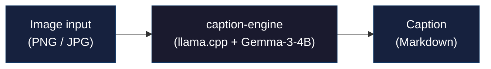

# caption-engine — Technical Documentation

## Architecture



> GPU-only, minimum 4 GB VRAM. Base image: `nvidia/cuda:13.2.1-runtime-ubuntu24.04`

## Web UI

Four tabs:

**Caption tab:**
- Drag & drop image, click to browse, or paste with `Ctrl+V`
- Click "Generate Caption"
- Output shown with model, timing, dimensions
- Copy to clipboard or save as `.md` file

**Results tab:**
- List of all caption jobs (latest first)
- Each job shows: image thumbnail, caption preview, metadata
- Per-job actions: Copy caption, download `.md`, download image, Delete job
- Jobs persist across restarts (volume mount)

**Logs tab:**
- Live application logs from the server
- Refresh and download log output

**Configuration tab:**
- Edit system prompt (sent with every request)
- Save to live config
- View model & runtime info

## GPU Requirements

- **Minimum 4GB VRAM** — enforced at startup
- **No CPU fallback** — exits with error if no GPU or insufficient VRAM
- All 32 layers offloaded to GPU (`GPU_LAYERS=32`)
- Context size: **4096 tokens** (fits model + KV cache in 4GB)

## Resilience & Safety

- **Llama-server health monitor** — background task pings `/v1/models` every 15s; auto-restarts on crash
- **Circuit breaker** — after 5 failed restarts, `/caption` returns `503` instead of hanging
- **Image validation** — rejects uploads >16MB, non-image formats, corrupted files, and dimensions >16384px (anti zip-bomb)
- **Thumbnails** — 320×240 JPEG thumbnails generated on job save; served via `/jobs/{id}/thumbnail`
- **Log rotation** — `server.log` rotates at 10MB, keeps 5 backups

## API Reference

| Endpoint              | Method   | Description                        |
|-----------------------|----------|------------------------------------|
| `/`                   | GET      | Web UI                           |
| `/caption`            | POST     | Generate caption from image        |
| `/health`             | GET      | Health check                       |
| `/health/model`       | GET      | Vision model reachability          |
| `/config`             | GET      | Current configuration              |
| `/config`             | PUT      | Update system prompt               |
| `/config`             | DELETE   | Reset to default system prompt     |
| `/config/default`     | GET      | Default system prompt              |
| `/logs`               | GET      | Application log lines              |
| `/jobs`               | GET      | List all caption jobs              |
| `/jobs/{id}`          | DELETE   | Delete a job (image + caption)     |
| `/jobs/{id}/image`    | GET      | Download job image                 |
| `/jobs/{id}/thumbnail`| GET      | Get 320×240 JPEG thumbnail         |
| `/jobs/{id}/caption.md` | GET    | Download job caption as .md        |

### `/caption` request

```
multipart/form-data:
  image         — image file (PNG/JPEG/GIF/BMP)
  system_prompt — optional override for system prompt
```

**Output is always Markdown.** No format selector — the model is prompted to produce markdown-formatted descriptions by default.

### `/caption` response

```json
{
  "caption": "A flowchart showing the authentication pipeline...",
  "model": "Gemma-3-4B",
  "processing_time_ms": 3420,
  "image_size": {"width": 1920, "height": 1080},
  "job_id": "a3f8b2c1d4e5"
}
```

### `/config` PUT request

```json
{
  "system_prompt": "Your custom prompt..."
}
```

## Configuration (.env)

```env
# Model
MODEL_PATH=/app/models/gemma-3-4b-it/gemma-3-4b-it-Q4_K_M.gguf
MMPROJ_PATH=/app/models/gemma-3-4b-it/mmproj-model-f16.gguf

# Server ports
LLAMA_API_PORT=8080       # llama.cpp backend
FASTAPI_PORT=8000         # FastAPI + Web UI

# GPU
GPU_LAYERS=32
CONTEXT_SIZE=4096
WORKERS=1
BATCH_SIZE=512

# System prompt
SYSTEM_PROMPT=You are a technical documentation analyst...

# Image validation
MAX_IMAGE_SIZE_MB=16
MAX_IMAGE_DIMENSION=16384

# Llama-server health monitor
LLAMA_HEALTH_INTERVAL=15
LLAMA_MAX_RESTARTS=5

# Log rotation
LOG_FILE=./logs/server.log
LOG_MAX_BYTES=10485760       # 10 MB
LOG_BACKUP_COUNT=5

# Job storage
JOBS_DIR=/app/jobs
```

## Memory Budget (4GB VRAM)

| Component         | Size     |
|-------------------|----------|
| Model (Q4_K_M)    | ~2.8 GB  |
| KV cache (4096 ctx)| ~0.4 GB |
| Overhead          | ~0.8 GB  |
| **Total**         | **~4.0 GB** |

## Building from Source

```bash
docker compose up --build -d
```

## Roadmap

- [ ] Batch processing (multiple images per request)
- [ ] OCR fallback (tesseract) for text-heavy images
- [ ] Caption caching (Redis)
- [ ] Export captions as batch
- [ ] Support for Gemma-3-8B multimodal variant
